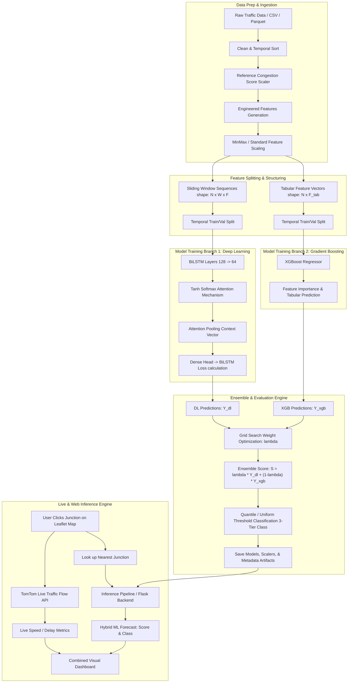

# Intelligent Traffic Congestion Prediction System: Architectural Blueprint & Workflow

This document provides a comprehensive technical blueprint and end-to-end workflow explanation for the **Intelligent Traffic Congestion Prediction** system.

---

## 1. System Overview & Core Philosophy

The system implements a **hybrid AI framework** designed to predict traffic congestion levels across road network junctions by fusing historical temporal patterns with non-linear feature interactions and live spatial traffic API data.

### Dual-Branch Hybrid Approach
1. **Temporal Sequence Branch (BiLSTM + Attention)**: Captures multi-step historical trends, cyclic time dependencies, and temporal build-up of congestion.
2. **Tabular Feature Branch (XGBoost Regressor)**: Captures complex non-linear feature interactions, rolling statistical aggregates, and localized junction behavior.
3. **Dynamic Ensemble Fusion**: Blends predictions from both models using an optimized weighting factor ($\lambda$) to achieve state-of-the-art accuracy and lower variance.
4. **Live Traffic Synthesis (TomTom API + Leaflet UI)**: Synchronizes real-time live speed/delay metrics with machine learning forecasts on an interactive GIS map.

---

## 2. End-to-End System Workflow Diagram



---

## 3. Core Component Architecture & Module Breakdown

The codebase follows a modular Python architecture located in [`traffic_hybrid/`](file:///c:/Users/albus/projects/traffic_congession/traffic_hybrid).

| Module | File Link | Key Responsibilities |
| :--- | :--- | :--- |
| **Configuration** | [`config.py`](file:///c:/Users/albus/projects/traffic_congession/traffic_hybrid/config.py) | Strongly-typed dataclasses for Data, Preprocessing, BiLSTM, XGBoost, Ensemble, and Evaluation hyper-parameters. |
| **Feature Engineering** | [`features.py`](file:///c:/Users/albus/projects/traffic_congession/traffic_hybrid/features.py) | Lag creation (1..168h), cyclic time signals ($\sin/\cos$), rolling statistics, speed drop rates, and density growth calculation. |
| **Dataset Preparation** | [`data.py`](file:///c:/Users/albus/projects/traffic_congession/traffic_hybrid/data.py) | Sliding window creation, tabular vector alignment, target generation, and zero-leak temporal train/val splits. |
| **BiLSTM Architecture** | [`model.py`](file:///c:/Users/albus/projects/traffic_congession/traffic_hybrid/model.py) | Keras model builder with custom `AttentionPooling` and `LastStepSlice` layers, Huber/MSE loss, and LR schedulers. |
| **Metrics & Evaluation** | [`metrics.py`](file:///c:/Users/albus/projects/traffic_congession/traffic_hybrid/metrics.py) | MAE, RMSE, MAPE, Accuracy, threshold binning (`quantile` / `uniform`), and ensemble weight optimization (`find_best_ensemble_weight`). |
| **Training Pipeline** | [`training.py`](file:///c:/Users/albus/projects/traffic_congession/traffic_hybrid/training.py) | Orchestrates end-to-end model training, fits XGBoost, searches optimal $\lambda$, and exports model artifacts (`.keras`, `.json`, `.pkl`). |
| **Inference Engine** | [`inference.py`](file:///c:/Users/albus/projects/traffic_congession/traffic_hybrid/inference.py) | Loads saved artifacts and runs batch or real-time feature transformation and prediction over input DataFrames. |
| **Web Server Backend** | [`web_ui.py`](file:///c:/Users/albus/projects/traffic_congession/traffic_hybrid/web_ui.py) | Flask web application backend servicing live TomTom Flow API proxy calls, junction distance matching, and model forecasts. |
| **CLI Launchers** | [`train.py`](file:///c:/Users/albus/projects/traffic_congession/train.py), [`webapp.py`](file:///c:/Users/albus/projects/traffic_congession/webapp.py), [`predict_live.py`](file:///c:/Users/albus/projects/traffic_congession/predict_live.py) | Entry points for CLI commands. |

---

## 4. Deep-Dive: Stage-by-Stage Workflow

### Stage 1: Configuration & Environment Setup
- Config parameters are defined in YAML files (e.g., [`configs/tuned_high_accuracy.yaml`](file:///c:/Users/albus/projects/traffic_congession/configs/tuned_high_accuracy.yaml)).
- Loaded via `load_config()` into structured dataclasses like `TrainingConfig`, `DataConfig`, `ModelConfig`, etc.

### Stage 2: Data Cleaning & Feature Engineering
1. **Cleaning**: Missing timestamps dropped, time-ordered per entity (junction), forward/backward filled.
2. **Reference Congestion Score**: Normalized composite target score derived from `speed` (inverted), `volume`, and `occupancy`.
3. **Temporal Signals**: Sine and Cosine encoding for `hour`, `day_of_week`, and `month` to maintain continuous cyclical transitions.
4. **Multi-Scale Lags & Rolling Metrics**:
   - Short-term lags: $t-1, t-2, t-3$
   - Medium & long-term lags: $t-6, t-12, t-24, t-48, t-72, t-168$ (hourly and weekly historical points)
   - Rolling statistics: Rolling mean/std over 3, 6, 12, 24, 48, 168 time steps.
   - Micro-dynamics: Speed drop rate $\frac{S_{t-1} - S_t}{S_{t-1}}$ and density growth rate.

### Stage 3: Dataset Vector Construction
- **Sequence Generation (`seq_train` / `seq_val`)**:
  Using a sliding window of size $W$ (e.g., 12 time steps = 1 hour at 5-min intervals), creates sequence arrays of shape $(N, \text{window\_size}, \text{num\_features})$.
- **Tabular Context Generation (`tab_train` / `tab_val`)**:
  Combines instantaneous feature state at time $t$ with optional multi-step sequence context vectors for XGBoost training.
- **Temporal Train/Validation Split**:
  Data is split chronologically based on a fixed ratio (e.g., 80% train / 20% validation) to prevent temporal data leakage.

### Stage 4: Dual-Branch Model Training

#### Branch A: BiLSTM + Attention Network
$$h_t = \text{BiLSTM}(x_t)$$
$$e_t = \tanh(W_a h_t + b_a)$$
$$\alpha_t = \frac{\exp(e_t)}{\sum_k \exp(e_k)}$$
$$c = \sum_t \alpha_t h_t$$
- The context vector $c$ represents the time-weighted summary of the past window, emphasizing critical bottleneck buildup points.
- Fed into a dense regression head predicting the target score $y_{t+h}$ where $h$ is the forecast horizon.

#### Branch B: XGBoost Regressor
- Decision-tree ensemble trained on engineered tabular features.
- Captures complex non-linear thresholds (e.g., peak hour + high density = congestion spike).

### Stage 5: Dynamic Weight Optimization & Classification
1. Validation predictions are generated: $\hat{y}_{\text{bilstm}}$ and $\hat{y}_{\text{xgb}}$.
2. Grid search evaluates ensemble weight $\lambda \in [0.6, 0.8]$:
   $$\hat{y}_{\text{ensemble}} = \lambda \cdot \hat{y}_{\text{bilstm}} + (1 - \lambda) \cdot \hat{y}_{\text{xgb}}$$
3. The optimal $\lambda$ minimizing RMSE / maximizing Accuracy is selected.
4. **Quantile Binning**: Continuous predictions are mapped to 3 discrete congestion levels:
   - **Class 0 (Low)**: Score $\le \text{Threshold}_1$
   - **Class 1 (Medium)**: $\text{Threshold}_1 < \text{Score} \le \text{Threshold}_2$
   - **Class 2 (High)**: Score $> \text{Threshold}_2$

### Stage 6: Live Web Application & Spatial Mapping Workflow
1. User opens Leaflet interactive map ([`webapp.py`](file:///c:/Users/albus/projects/traffic_congession/webapp.py)).
2. When clicking anywhere on the map:
   - Backend queries **TomTom Flow Segment API** for real-time speed, free-flow speed, and delay metric at those coordinates.
   - Haversine distance algorithm calculates the nearest pre-configured junction from [`config/junction_locations.json`](file:///c:/Users/albus/projects/traffic_congession/config/junction_locations.json).
   - If within threshold distance ($\le 5\text{ km}$), the model executes real-time inference for that junction using historical data buffer.
   - Dashboard updates with **Live Conditions** alongside **ML Model Future Congestion Forecast**.

---

## 5. Artifact Output Structure

When training completes, the system generates persistent artifacts in `artifacts/`:
- `bilstm_attention.keras` — Trained Keras Deep Learning model.
- `xgboost_model.json` — Trained XGBoost model parameters.
- `feature_scaler.pkl` — Fitted MinMaxScaler for input features.
- `reference_scaler.pkl` — Target scaler reference.
- `metadata.pkl` — Feature names, thresholds, ensemble weights, and window sizes.
- `metrics.json` & `training_report.md` — Performance benchmarks (Accuracy, MAE, RMSE, MAPE).

---

## 6. How to Run the Workflow

```bash
# 1. Install dependencies
.\.venv\Scripts\python.exe -m pip install -r requirements.txt

# 2. Train the hybrid ensemble model
python train.py --config configs/tuned_high_accuracy.yaml

# 3. Perform offline batch prediction
python predict_live.py --artifacts artifacts/tuned_high_accuracy --input data/traffic.csv --output artifacts/tuned_high_accuracy/live_predictions.csv

# 4. Launch the Interactive Web Dashboard
python webapp.py --artifacts artifacts/tuned_high_accuracy --input data/traffic.csv
```
